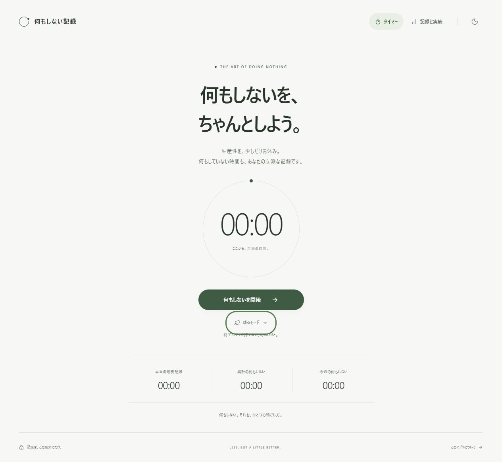
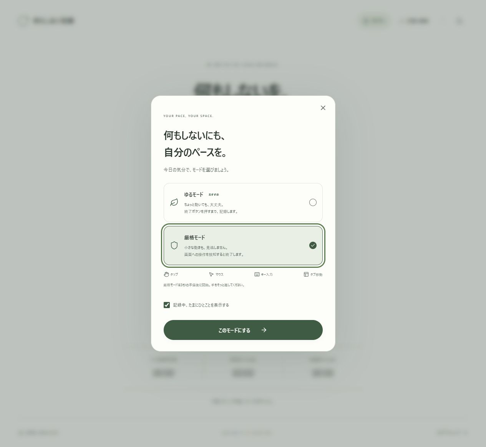
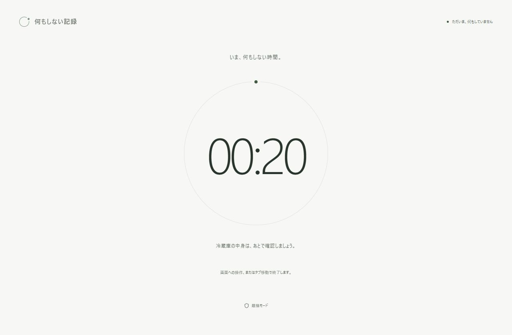
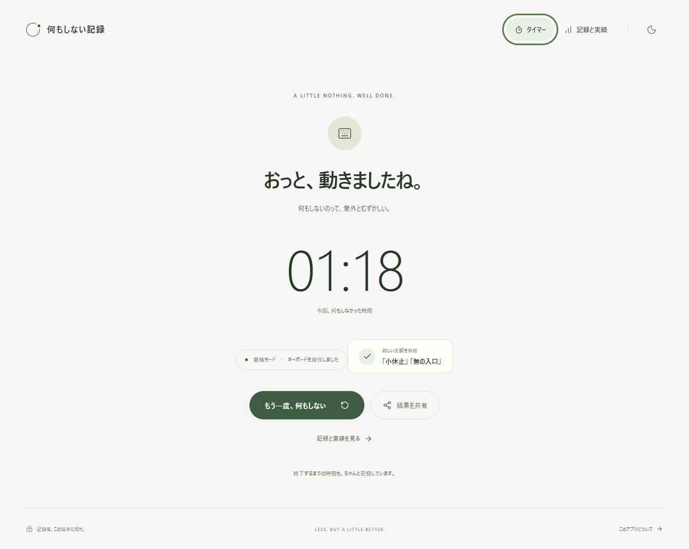
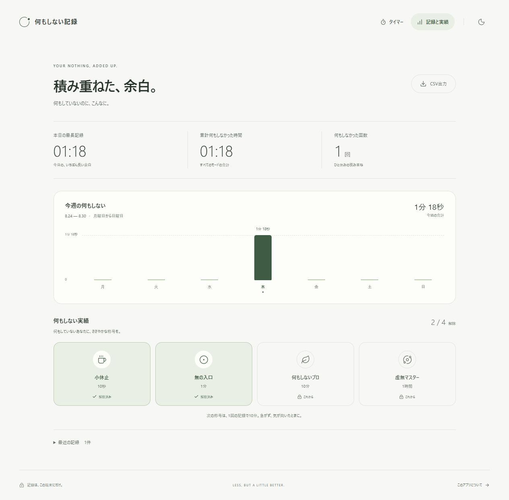

# 何もしない記録

何もしない時間を、ちゃんと記録する。

「何もしていない」を、ひとつの実績にする小さなWebアプリです。ボタンを押したら、あとは余白と時計を眺めるだけ。休む時間に、少しだけユーモアを添えました。

## 公開・検証状況

<!-- RELEASE_STATUS_BEGIN: 公開確認と実行結果に合わせて更新する -->

- アプリURL（本番公開・実ブラウザー確認済み）：[doing-nothing-timer.vercel.app](https://doing-nothing-timer.vercel.app)
- GitHub（公開リポジトリ作成済み・初回push待ち）：[shunsoco-stack/doing-nothing-timer](https://github.com/shunsoco-stack/doing-nothing-timer)
- `lint` / `typecheck` / `build`：成功。Vitestは5ファイル・203件すべて成功。
- Secret Scan：成功。確認時点で45テキストファイルを検査し、6バイナリ／大容量ファイルを除外。`npm audit` の検出脆弱性は0件。
- GitHub Secret Scanning / Push Protection：有効化済み。
- ローカル本番ビルドの実ブラウザーで、配信元への接続不可時の起動・計測継続・保存・再読込を確認済み。
- 公開アプリのスクリーンショット5枚：撮影・保存・目視確認済み。下記に掲載しています。
- 公開URL・静的アセットのHTTP応答、メタデータ、アイコン、セキュリティヘッダーを確認済み。
- Vercel Analytics：SDK実装済み。基本Web Analyticsの有効化は所有者本人の確認操作待ちです。加えて、Hobbyプランではカスタムイベントを集計できません。[Analyticsの制約](#analytics)を参照してください。

検証の範囲と未確認項目は [docs/verification.md](docs/verification.md) にまとめています。ローカルの最終検証、Vercel本番デプロイ、公開画面の操作確認・撮影を完了しています。GitHubの初回pushとAnalyticsの有効化・集計は別途記載の状態です。

<!-- RELEASE_STATUS_END -->

## 使い方

1. 厳格モード、またはゆるモードを選びます。
2. 「何もしないを開始」を押します。
3. 何もしません。終わったら結果と実績を確認します。

| モード | 終了条件 |
| --- | --- |
| 厳格モード | 画面タップ、マウス操作、キーボード操作、別タブへの移動などを検知すると終了。結果に操作の種類を表示します。 |
| ゆるモード | 終了ボタンを押すまで継続。別タブやバックグラウンドに移っている間も経過時間に含めます。 |

厳格モードは3秒の準備時間のあとに始まります。準備中は操作しても失敗にならず、キャンセルもできます。厳格モードの判定対象はブラウザー上の操作です。実際に体を動かしたかどうかを調べるものではありません。

## 機能と設計

- 開始時刻を保存し、`Date.now() - startedAt` から経過時間を計算。描画やタイマーの呼び出し回数に依存しません。
- 本日の最長記録、累計時間、月曜〜日曜の週間記録を表示。
- 10秒・1分・10分・60分の節目で実績を解除。
- 記録中は大きな時計を中心に、数秒ごとにくだらないひとことを表示。
- 記録は端末内の `localStorage` に保存。アカウント登録不要です。
- UTF-8 BOM付きCSVで記録を書き出し。
- 結果を端末の共有機能で共有。非対応の場合はコピーまたは手動コピーへ切り替え。
- モバイルファースト、ライト／ダーク／システム連動のテーマ、PWAに対応。
- キーボード操作、フォーカス表示、読み上げ向けのラベル、動きを抑える設定に配慮。

Apple風の静かなUIを目指し、あたたかな白、セージグリーン、広い余白、控えめな動きを採用しました。計測中は情報量を絞り、「何もない」ことそのものを画面の中心に置いています。

### 実績

実績の条件は、1回の記録で次の時間に到達することです。

| 時間 | 実績 |
| --- | --- |
| 10秒 | 小休止 |
| 1分 | 無の入口 |
| 10分 | 何もしないプロ |
| 60分 | 虚無マスター |

### 集計ルール

日付は利用端末のローカル時刻を使います。「本日の最長記録」は今日終了した記録の最大値、「累計」は保存された記録の合計です。週間記録は今週の月曜〜日曜で集計し、日付をまたいだ時間は各日に分けます。

開始時刻との差分で計算するため、バックグラウンドで描画間隔が延びても、呼び出し回数を足す方式のようなズレは積み重なりません。ただし端末の時計を手動で変更すると値に影響します。精密計測器や改ざん防止タイマーとしての利用は想定していません。

## スクリーンショット

<!-- SCREENSHOTS_STATUS_BEGIN: 公開アプリでの撮影後に更新する -->

以下の5枚は [公開アプリ](https://doing-nothing-timer.vercel.app) を実ブラウザーで操作して撮影し、`public/screenshots/` に保存・目視確認したものです。記録データの直接編集や時刻の偽装は行っていません。

<!-- SCREENSHOTS_STATUS_END -->

### 1. 初期画面



### 2. モード選択



### 3. 記録中



### 4. 厳格モード失敗画面



### 5. 週間記録・実績



## ローカル開発

Node.js 22以上とnpmを使用します。アプリ本体の動作にAPIキーや有料APIは必要ありません。

```bash
npm install
npm run dev
```

[http://127.0.0.1:3047](http://127.0.0.1:3047) を開きます。依存関係をロックファイルどおりに再現する場合は `npm ci` を使ってください。

### 検証

```bash
npm run lint
npm run typecheck
npm test
npm run secret-scan
npm audit
npm run build
```

本番ビルドをローカルで確認する場合は、ビルド後に `npm start` を実行します。Secret Scanはソース内の秘密情報パターンを確認する補助チェックであり、情報漏えいが一切ないことを保証するものではありません。除外対象やチェックの制約は [docs/security.md](docs/security.md)、実行結果は [docs/verification.md](docs/verification.md) を参照してください。

### 技術構成

- Next.js 16.3.3 / React 19.2.8 / TypeScript 5.9.3
- Tailwind CSS 4.3.3 / Lucide React
- Page Visibility API / Web Share API / Clipboard API
- localStorage / Web App Manifest / Service Worker
- Vercel / Vercel Analytics 2.0.1
- ESLint / Vitest

Next.jsの実装を変更する際は、`AGENTS.md` とインストール済みの `node_modules/next/dist/docs/` を確認してください。

## 保存・プライバシー・オフライン

記録は使用中のブラウザーに保存されます。アカウント、クラウドへの記録同期、端末間の共有データベースはありません。ブラウザーの保存データ削除、プライベートモード、保存容量などの制限により記録を失う場合があるため、必要な記録はCSVで保管してください。CSVには記録の日時と時間が含まれるため、他人へ渡す際は内容を確認してください。

`localStorage` は利用者自身が編集できます。このアプリは「何もしなかった」ことの証明や、不正防止を目的としたサービスではありません。

一度オンラインで読み込み、Service Workerが準備されたあとは、オフラインでも計測と端末内への保存ができます。PWAのインストール方法や利用可否はブラウザーによって異なります。外部への共有やAnalyticsの通信には、対応する端末機能やネットワークが必要です。

### Analytics

Vercel AnalyticsのSDKに、次の4種類のイベントを実装しています。

| イベント | 送信する項目 |
| --- | --- |
| `session_start` | `mode`（厳格／ゆる） |
| `session_end` | `mode`、`duration_seconds`（経過秒数の整数） |
| `achievement_unlock` | `achievement`（4種類の実績の固定識別名）、`mode` |
| `result_share` | `method`（`native`／`clipboard`）、`mode` |

終了理由、打鍵したキーの内容、入力文字、記録ID・利用者ID、正確な開始・終了時刻、保存済み記録の一覧は送信しません。DNT（Do Not Track）とGPC（Global Privacy Control）の設定を尊重し、有効な場合はイベント送信を抑止します。ページビューの送信URLからもクエリーとフラグメントを除きます。通常のアクセス解析と端末内の記録保存は別の仕組みです。

現時点では基本Web Analyticsも未有効です。有効化には所有者本人によるVercelダッシュボードの確認操作が必要なため、SDKの実装完了と、本番のデータ収集・ダッシュボード集計の確認完了を区別しています。

また、公開先の接続チームはHobbyプランです。基本Web Analyticsを有効にしても、カスタムイベントの集計はPro／Enterpriseプランに限定されます。4種類のカスタムイベントを本番で集計できたという検証結果はありません。プラン変更、有料機能の契約、本人確認の回避は行っていません。[Vercel公式ドキュメント](https://vercel.com/docs/analytics/custom-events)

## ライセンス・紹介文

[MIT License](LICENSE)。ポートフォリオ、Tsukutta、YOUTRUST向けの掲載用原稿は [docs/publish-copy.md](docs/publish-copy.md) にまとめています。
